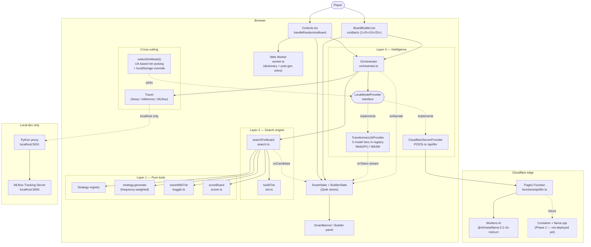
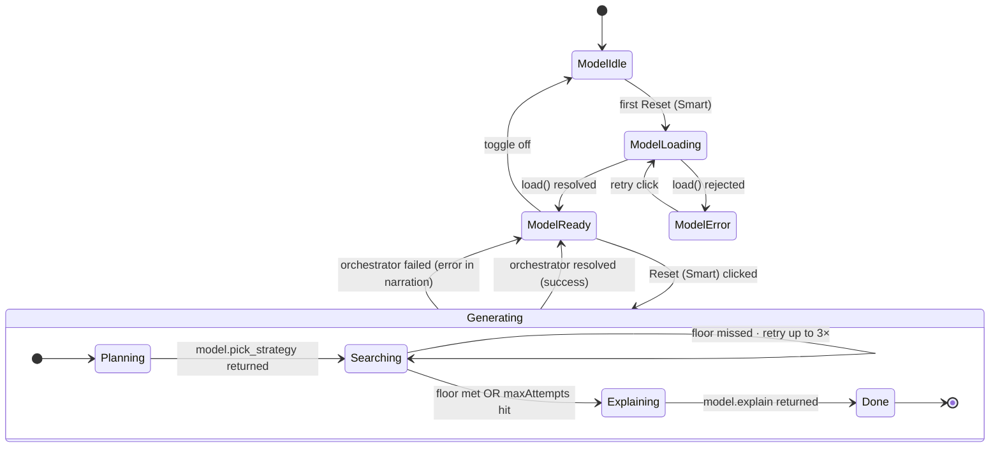
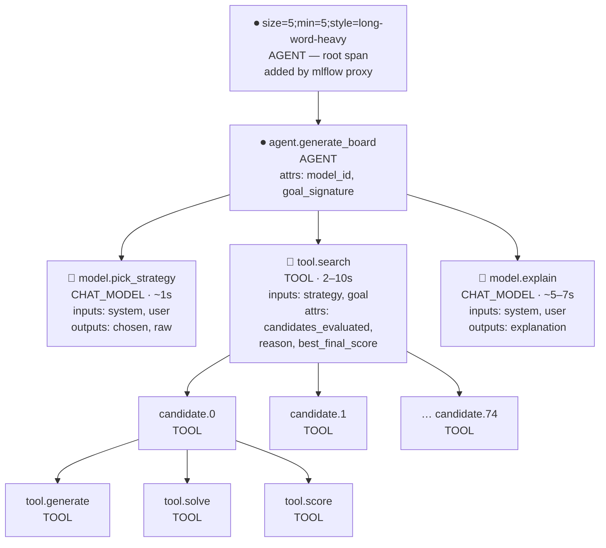
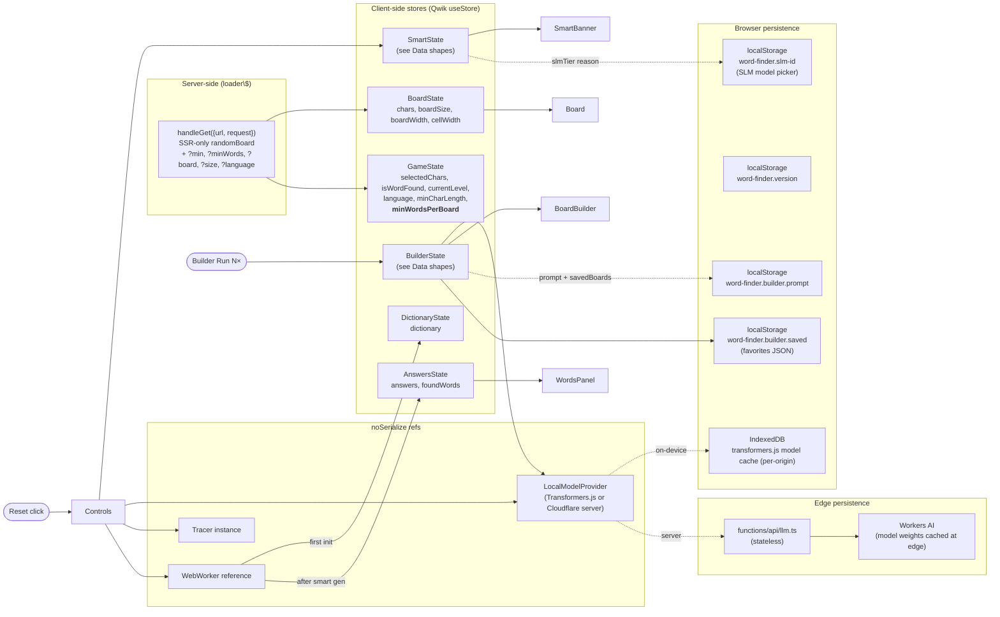

# Intelligent board generation — how it actually works

Companion to `[PLAN.md](./PLAN.md)`, `[AGENTIC_VISION.md](./AGENTIC_VISION.md)`, and `[SERVER_SLM.md](./SERVER_SLM.md)`. Those docs describe the build plan, the asymptote, and the cost trade-off respectively; this doc walks through **what happens when a player clicks Reset Board** (and **Run 5×** in the Board Builder) with diagrams pinned to the actual code paths.

You can navigate here by topic:

1. [Layered architecture](#layered-architecture) — three layers with hard boundaries, plus on-device vs server-side providers
2. [End-to-end sequence](#end-to-end-sequence) — what happens on Reset, step by step
3. [Control flow](#control-flow) — the decision tree, including device tier, floor retry, and fallback
4. [Smart Mode lifecycle](#smart-mode-state-machine) — model load + generation states
5. [Data shapes](#data-shapes) — types passing between layers
6. [The trace tree](#the-trace-tree) — what lands in MLflow per generation
7. [State management](#state-management) — where state lives, who reads/writes
8. [The Board Builder loop](#the-board-builder-loop) — batch runs, saved favorites, prompt iteration
9. [Business logic vs application logic](#business-logic-vs-application-logic) — what's a *rule* vs what's a *plumbing concern*

---

## Layered architecture

The three-layer rule from `PLAN.md` is enforced at the import level. **Layer 1 has no model dependency. Layer 2 has no model dependency.** Only Layer 3 talks to the SLM. The SLM itself is pluggable: today it's either an on-device WebGPU/WASM model (Transformers.js) or a server-side call to Cloudflare Workers AI through a Pages Function — both implement the same `LocalModelProvider` interface.




**Why the boundary matters.** If the SLM is unavailable (model failed to load, WebGPU denied, network gone, server down), Smart Mode falls through to the Layer 1 / Layer 2 path with no orchestrator and gives the player a board anyway. The player never sees a blank screen because of an LLM hiccup.

**Why two providers, one interface.** `selectSlmModel()` runs at Reset time and picks the right `LocalModelProvider` for the device — `TransformersJsProvider` for desktops with adequate RAM, `CloudflareServerProvider` for iOS / low-RAM devices that historically OOM. The orchestrator is identical regardless.

---

## End-to-end sequence

This is what actually happens when the player clicks **Reset Board** with Smart Mode enabled (the default). On the first click of a session the model has to load; subsequent clicks skip straight to generation.

```mermaid
sequenceDiagram
  autonumber
  actor Player
  participant Controls as Controls.tsx
  participant Smart as SmartState (store)
  participant Provider as TransformersJsProvider
  participant Orch as Orchestrator
  participant Reg as Strategy registry
  participant Search as searchForBoard
  participant Strategy as Strategy.generate
  participant Solver as solveWithTrie
  participant Scorer as scoreBoard
  participant Tracer as Tracer
  participant Worker as Web Worker

  Player->>Controls: Reset Board
  Controls->>Smart: status=loading-model? generating? narration=[]
  Controls->>Provider: ensureSmartLoaded()
  alt model not yet loaded
    Provider->>Provider: dynamic-import @huggingface/transformers
    Provider->>Provider: pipeline('text-generation', Qwen2.5-0.5B, {dtype:'q4', device})
    Provider-->>Smart: progress callback (loaded/total)
  end
  Provider-->>Controls: ready

  Controls->>Orch: new Orchestrator({model, tracer, tools, budget, callbacks})
  Controls->>Orch: generateBoard(goal, dictionary)

  Orch->>Tracer: startTrace
  Orch->>Tracer: open root span: agent.generate_board (AGENT)

  rect rgba(160,200,255,0.18)
    Note over Orch,Provider: Step 1 — pick strategy
    Orch->>Smart: narrate "🤔 Asking model which strategy to use…"
    Orch->>Tracer: span model.pick_strategy (CHAT_MODEL)
    Orch->>Provider: generate({system: "router…", user: goal JSON, maxTokens:24, T:0.1, onToken})
    Provider-->>Smart: per-token chunks → liveTokens
    Provider-->>Orch: {text, elapsedMs}
    Orch->>Reg: validate text against availableStrategies
    Note over Orch: Falls back to first strategy if SLM<br/>output doesn't name a known one
    Orch->>Smart: narrate "💡 Strategy chosen: frequency-weighted"
  end

  rect rgba(160,255,180,0.18)
    Note over Orch,Search: Step 2 — search (with retry-to-floor)
    Note over Controls: Budget scales with floor:<br/>floor < 150  → 200×3 = 600 cands<br/>floor ≥ 150  → 300×3 = 900 cands<br/>floor ≥ 200  → 400×5 = 2000 cands<br/>floor ≥ 250  → 600×5 = 3000 cands
    loop attempt = 1..maxAttempts
      Orch->>Smart: narrate "🔍 Searching: best-of-N, target ≥M…"
      Orch->>Tracer: span tool.search (TOOL)
      Orch->>Search: searchForBoard({size, dict, strategy, weights, budget, onCandidate})
      activate Search
      Search->>Trie: build once per dictionary
      loop up to maxCandidates within maxMs
        Search->>Strategy: generate({size, language})
        Strategy-->>Search: 25-char board
        Search->>Solver: solveWithTrie(trie, board)
        Solver-->>Search: words[]
        Search->>Scorer: scoreBoard(board, words, {minLen, recentBoards, weights})
        Scorer-->>Search: BoardScore
        Search-->>Smart: onCandidate({index, total, bestScore, playerRelevant})
      end
      Search-->>Orch: SearchResult (kept across attempts: best-scoring)
      deactivate Search
      alt result.playerRelevantWords ≥ minPlayerRelevantWords
        Orch->>Smart: narrate "✓ Floor met"
        Note over Orch: break loop
      else attempt < maxAttempts
        Orch->>Smart: narrate "↩️ Below floor, retrying…"
      else
        Orch->>Smart: narrate "⚠️ Floor not met after K attempts. Best: M. Returning best."
        Note over Orch: floorMet=false; banner shows yellow warning
      end
    end
    Orch->>Smart: narrate "📊 Search done"
    Note over Orch: Tracks totalCandidatesEvaluated across all attempts<br/>for "best of K" UI
  end

  rect rgba(255,200,160,0.18)
    Note over Orch,Provider: Step 3 — explain (no-spoiler prompt)
    Orch->>Smart: narrate "💬 Asking model to explain…"
    Orch->>Tracer: span model.explain (CHAT_MODEL)
    Orch->>Provider: generate({system: "NEVER name words…", user: counts+ratios only, maxTokens:96, T:0.4})
    Provider-->>Smart: per-token chunks → liveTokens
    Provider-->>Orch: {text}
    Orch->>Smart: narrate "✅ Done"
  end

  Orch->>Tracer: close root span; finish trace with outcome
  Orch-->>Controls: OrchestratorResult

  Controls->>Smart: lastExplanation, lastStrategy, lastFinalScore, lastModelCalls, lastElapsedMs
  Controls->>Smart: generationStatus = complete; bannerDismissed = false
  Controls->>Worker: postMessage({language, board, minCharLength}) — re-solve for answers panel
  Controls->>Tracer: tracer.flush() (fire-and-forget)
  Tracer-->>Proxy: POST /traces (dev only — NoopTracer on prod)
```


The colored bands match the three orchestrator steps you see in MLflow's span tree: **pick → search → explain**, all under one AGENT root.

---

## Control flow

The decision tree, including device-tier picking, the floor-retry loop, and the legacy fallback.

```mermaid
flowchart TD
  Start([Player clicks Reset Board]) --> Q1{Smart Mode<br/>enabled?}
  Q1 -->|no| Legacy["randomBoard frequency-weighted<br/>single shot, ~1ms"]
  Legacy --> Worker1["Worker re-solves for answers panel"]
  Worker1 --> EndLegacy([Update UI])

  Q1 -->|yes| TierPick["selectSlmModel()<br/>1. localStorage user pref<br/>2. UA: iPhone* → server<br/>3. UA: mobile → SmolLM2-360M<br/>4. UA: desktop → Qwen2.5-0.5B"]
  TierPick --> Q2{Model<br/>loaded?}
  Q2 -->|no| LoadBranch{Tier?}
  LoadBranch -->|server| InstantiateServer["new CloudflareServerProvider<br/>load() is a no-op<br/>(model lives upstream)"]
  LoadBranch -->|on-device| LoadLocal["new TransformersJsProvider<br/>Lazy-import @huggingface/transformers<br/>Download model q4 (~110/220/786/1100 MB)<br/>Compile to WebGPU / WASM"]
  LoadLocal --> Q3{Load OK?}
  Q3 -->|no| Fallback["Drop to legacy randomBoard<br/>(player still gets a board)"]
  Fallback --> Worker1
  Q3 -->|yes| Pick
  InstantiateServer --> Pick
  Q2 -->|yes| Pick

  Pick["CHAT_MODEL: model.pick_strategy<br/>system: 'router, reply with one of…'<br/>user: goal as JSON (style, difficulty,<br/>novelty, description, requiredLetters)<br/>maxTokens=24, T=0.1, stream tokens"]
  Pick --> Validate["Match SLM output against<br/>tools.availableStrategies<br/>Default to first if no match"]

  Validate --> Init["Apply weightsForStyle(goal.style)<br/>e.g., long-word-heavy →<br/>maxWordLength 12, averageWordLength 6,<br/>playerRelevantWords 0.5"]

  Init --> SearchLoop["TOOL: tool.search<br/>budget scales with goal.minPlayerRelevantWords<br/>(see budget table)<br/>onCandidate fires per evaluation"]

  SearchLoop --> Floor1{playerRelevant<br/>≥ minWordsPerBoard?}
  Floor1 -->|yes| Explain
  Floor1 -->|no| Q4{attempts < maxAttempts?}
  Q4 -->|yes| SearchLoop
  Q4 -->|no, floorMet=false| Warn["Set warning banner:<br/>⚠️ Floor not met"]
  Warn --> Explain

  Explain["CHAT_MODEL: model.explain<br/>system: HARD RULE — no spoilers<br/>user: counts + vowel ratio + rare-letter count<br/>+ style only (no board letters, no example words)<br/>maxTokens=80, T=0.25, stream tokens<br/>+ dedupeSentences post-process"]

  Explain --> Apply["BoardState.chars ← result.board<br/>SmartState lastX fields ← result fields<br/>(floorMet, attemptsMade, totalCandidatesEvaluated, …)<br/>generationStatus = complete<br/>bannerDismissed = false"]
  Apply --> Worker2["Worker re-solves the new board<br/>(answers panel populates)"]
  Worker2 --> Trace["Tracer.flush() fire-and-forget<br/>(NoopTracer on prod, MLflowTracer on localhost)"]
  Trace --> EndSmart([Banner shows result + 'best of K' depth])
```




**Five things to notice:**

1. **Tier picking happens before load.** `selectSlmModel()` is called fresh on every Reset because the player can change the model picker between resets. iOS UAs route to the server-side provider by default to avoid the historical OOM crash.
2. **The floor is a *retry-bounded* gate, not infinite.** Budget scales with the floor — 200 cands × 3 attempts for soft targets, up to 600 × 5 for aggressive ones. After the budget is spent, `floorMet=false` is set on the result and a yellow warning banner shows alongside the explanation. The player gets the best attempted board even if the target wasn't hit; we don't spin forever.
3. **The orchestrator is provider-agnostic.** Whether Layer 3 calls Transformers.js (on-device) or Cloudflare Workers AI (server-side via `/api/llm`), the orchestrator code is identical. Only the wall-clock latency differs.
4. **The model is allowed to be wrong about strategy choice.** If Qwen / Llama replies with garbage, the validator falls back to the first registered strategy. The system stays correct.
5. **The explain prompt is fed *qualities*, not data.** The model sees counts and ratios but never the board letters or solver output, so it can't quote a real word. Output is also passed through `dedupeSentences()` to strip the smaller models' tendency to loop.

---

## Smart Mode state machine

Two interlocking lifecycles: model load (once per session) and generation (per click).




The model load is **lazy**: nothing downloads until the player clicks Reset for the first time. Once `ModelReady`, every subsequent generation is just the inner state machine.

---

## Data shapes

The actual TypeScript types passed between layers. These are stable contracts — the offline optimizer (Phase 6) will tune *behavior*, not these shapes.

```mermaid
classDiagram
  direction LR

  class BoardGenerationGoal {
    +size: number
    +minWordLength: number
    +minPlayerRelevantWords?: number
    +maxAttempts?: number
    +style?: balanced|long-word-heavy|classic|rare-letter|chaotic
    +difficulty?: easy|medium|hard
    +novelty?: low|medium|high
    +requiredLetters?: string[]
    +preferredLetters?: string[]
    +avoidedLetters?: string[]
    +description?: string
  }

  class SlmModel {
    +id: string
    +modelId: string
    +approxSizeMb: number
    +displayName: string
    +recommendation: low-end|modern-mobile|desktop|experimental
    +note: string
  }

  class BuilderState {
    +open: boolean
    +prompt: string
    +isRunning: boolean
    +cancelRequested: boolean
    +runsCompleted: number
    +runsTotal: number
    +batchResults: BatchResult[]
    +savedBoards: SavedBoard[]
  }

  class BatchResult {
    +id: string
    +board: string
    +finalScore: number
    +playerRelevantWords: number
    +maxWordLength: number
    +strategy: string
    +elapsedMs: number
    +totalCandidatesEvaluated: number
    +explanation: string
    +floorMet: boolean
    +createdAt: string
  }

  class SavedBoard {
    +id: string
    +board: string
    +finalScore: number
    +playerRelevantWords: number
    +note: string
    +isFavorite: boolean
    +savedAt: string
  }

  class OrchestratorConfig {
    +model: LocalModelProvider
    +tracer: Tracer
    +tools: ToolRegistry
    +budget?: OrchestratorBudget
    +callbacks?: OrchestratorCallbacks
  }

  class OrchestratorCallbacks {
    +onNarrate?: (line) => void
    +onTokenStream?: (chunk, accumulator) => void
    +onSearchProgress?: (info) => void
  }

  class OrchestratorResult {
    +board: string
    +score: BoardScore
    +words: string[]
    +strategyChosen: string
    +explanation: string
    +modelCalls: number
    +elapsedMs: number
    +trace: GenerationTrace
    +floorMet: boolean
    +attemptsMade: number
    +totalCandidatesEvaluated: number
  }

  class BoardScore {
    +totalWords: number
    +playerRelevantWords: number
    +wordsByLength: Record~length, count~
    +averageWordLength: number
    +maxWordLength: number
    +uniqueLetters: number
    +vowelRatio: number
    +vowelInventoryHash: string
    +prefixDiversity: number
    +letterEntropy: number
    +similarityToRecent: number
    +finalScore: number
  }

  class SearchResult {
    +board: string
    +score: BoardScore
    +words: string[]
    +strategyUsed: string
    +candidatesEvaluated: number
    +elapsedMs: number
    +reason: target-met|max-candidates|max-ms
    +trace?: GenerationTrace
  }

  class GenerationTrace {
    +trace_id: string
    +generation_id: string
    +goal_signature: string
    +prompt_versions: Record
    +model_versions: Record
    +spans: Span[]
    +outcome: GenerationOutcome
    +created_at: string
  }

  class Span {
    +span_id: string
    +parent_span_id: string|null
    +name: string
    +type: AGENT|CHAIN|CHAT_MODEL|TOOL|RETRIEVER|EVALUATION
    +start_ms: number
    +end_ms: number
    +attributes: Record
    +inputs?: any
    +outputs?: any
    +error?: object
  }

  class SmartState {
    +enabled: boolean
    +modelStatus: idle|loading|ready|error
    +modelLoadProgress: number
    +slmTier?: { id, modelId, approxSizeMb, displayName, reason }
    +generationStatus: idle|running|complete|error
    +narration: string[]
    +liveTokens: string
    +searchProgress?: object
    +lastExplanation?: string
    +lastStrategy?: string
    +lastFinalScore?: number
    +lastModelCalls?: number
    +lastElapsedMs?: number
    +lastFloorMet?: boolean
    +lastAttempts?: number
    +lastFloorTarget?: number
    +lastPlayerRelevantWords?: number
    +lastTotalCandidates?: number
    +bannerDismissed: boolean
    +refs: { provider, tracer }
  }

  class LocalModelProvider {
    <<interface>>
    +id: string
    +displayName: string
    +isReady: boolean
    +capabilities: { json, streaming, toolCalling }
    +load(onProgress?) Promise
    +generate(GenerateRequest) Promise~GenerateResponse~
  }

  class GenerateRequest {
    +messages: ChatMessage[]
    +maxTokens?: number
    +temperature?: number
    +jsonOnly?: boolean
    +signal?: AbortSignal
    +onToken?: (chunk) => void
  }

  OrchestratorConfig --> LocalModelProvider
  OrchestratorConfig --> OrchestratorCallbacks
  OrchestratorResult --> BoardScore
  OrchestratorResult --> GenerationTrace
  GenerationTrace --> Span
  SearchResult --> BoardScore
  LocalModelProvider --> GenerateRequest
  BuilderState --> BatchResult
  BuilderState --> SavedBoard
```


**The `BoardGenerationGoal` is the contract between the player UI and the engine.** Today the player drives it through Controls (`gameState.minWordsPerBoard` → `goal.minPlayerRelevantWords`) and the Board Builder (`builderState.prompt` → `goal.description`). When we add a preferences panel later (style picker, required letters, novelty slider), it just builds one of these. Nothing else changes.

---

## The trace tree

What ends up in MLflow per generation. This is what the user sees clicking through `word-finder-player` → any trace.




A typical generation produces **~200–800+ spans** depending on budget: 1 root + 1 agent + 2 model calls + 1 search + (200–600 candidates × 4 child spans). MLflow auto-classifies the experiment as "GenAI apps & agents" once it sees the AGENT/CHAT_MODEL types.

Every span carries:

- `mlflow.span.type` — drives the icon and the auto-classifier
- `mlflow.span.inputs` / `mlflow.span.outputs` — JSON-stringified, truncated to 8 KB
- Custom `word_finder.`* attributes on the AGENT root: `generation_id`, `final_score`, `candidates_evaluated`, `selected_strategy`, `elapsed_ms`. These are what offline analysis (Phase 6) joins on.

**Trace shape is identical across providers.** The `model.pick_strategy` and `model.explain` spans look the same whether the model ran on-device (Transformers.js) or upstream (Cloudflare Workers AI via `/api/llm`). The only signal that distinguishes them is `model_versions.orchestrator` — `transformers-js:HuggingFaceTB/SmolLM2-360M-Instruct` vs `cloudflare-server:@cf/meta/llama-3.2-1b-instruct`. This invariance is the whole point of the `LocalModelProvider` abstraction.

---

## State management

Six stores, six jobs.




**Why six stores not one.** Each store's lifetime and consumer set is different:

- `BoardState` resets on Reset.
- `AnswersState` is rebuilt by the worker after each generation.
- `GameState` holds player config (Word Size, Min Words, language) — survives Reset.
- `DictionaryState` is loaded once by the worker, never changes.
- `SmartState` survives across generations — the SLM and tracer instances live there behind `noSerialize`.
- `BuilderState` is the Board Builder side panel's local state plus persisted favorites.

**Why noSerialize.** Qwik tries to serialize stores so the page is resumable. Heavy objects (Transformers.js generator, MLflow tracer with in-flight Promises, fetch-based provider) can't be JSON-stringified, so we wrap them in `noSerialize()` and Qwik skips them.

**Provider plurality.** `SmartState.refs.provider` is *always* a `LocalModelProvider`, but its identity depends on `selectSlmModel()`. Switching the SLM Model picker drops the current provider (resets `modelStatus` to `idle`) and the next Reset instantiates the new one. Same store slot, different concrete class.

---

## The Board Builder loop

Parallel use case to Reset Board: the **Board Builder** side panel runs the same orchestrator N times in a row without committing each result to game state. The player picks a result (or stars one for later) and only that one becomes the live board.

```mermaid
sequenceDiagram
  actor Player
  participant Builder as BoardBuilder.tsx
  participant BuilderState as BuilderState
  participant Smart as SmartState
  participant Orch as Orchestrator
  participant Storage as localStorage

  Player->>Builder: write prompt → "lots of long words ending in -ing"
  Builder->>BuilderState: prompt updated
  BuilderState->>Storage: persist prompt (debounced)

  Player->>Builder: click "5×"
  Builder->>BuilderState: isRunning=true, runsTotal=5, batchResults=[]
  loop i = 0..4
    Builder->>Orch: new Orchestrator({…, callbacks: noop}); generateBoard({…, description: prompt, maxAttempts:1})
    Note over Orch: Reuses Smart's SLM provider + tracer.<br/>Each run still emits a full MLflow trace.
    Orch-->>Builder: OrchestratorResult
    Builder->>BuilderState: append BatchResult to batchResults
    Builder->>BuilderState: runsCompleted = i+1
    alt cancelRequested
      Note over Builder: break loop
    end
  end
  Builder->>BuilderState: isRunning=false

  alt Player clicks ↩ on a row
    Builder->>Smart: noop (Smart already has provider/tracer)
    Builder->>BoardState: chars = row.board
    Builder->>Worker: postMessage({language, board, minCharLength}) — re-solve
    Note over Player: That row's board is now live in the game.
  else Player clicks ☆ on a row
    Builder->>BuilderState: prepend SavedBoard to savedBoards
    Builder->>Storage: persist savedBoards
  end
```


**Why batch runs use `maxAttempts: 1`.** The retry-to-floor logic exists for Reset Board where the player wants *one* board they'll play. In a batch, every result is a sample we want to compare; retrying-then-keeping-the-best collapses the variance the player asked for. With `maxAttempts: 1`, each row in the table is one independent search and the table directly shows the random distribution of outcomes.

**Why the orchestrator is reused, not the orchestrator's outputs.** The Board Builder calls `new Orchestrator(...)` per run because each run gets fresh callbacks (the batch UI doesn't want to clobber Smart's narration). The provider and tracer are reused — both are stateless across calls.

**Why MLflow trace shape is unchanged.** A batch of 5 produces 5 separate traces in MLflow, each with the full AGENT → CHAT_MODEL → TOOL → CHAT_MODEL tree. Useful when comparing "did model.pick_strategy choose differently across runs?" or "did adding 'rare letters' to the prompt move the strategy choice?".

---

## Business logic vs application logic

The user-facing rules — *what makes a board good, what counts as a fair board, what we promise the player* — live in pure functions. Application concerns — *how Qwik wires it up, where the model is hosted, what UI shows what* — live in components and hooks. The boundary is sharp on purpose.


| Concern                                            | Layer               | File                                                             | Why it lives there                                                                                                                                            |
| -------------------------------------------------- | ------------------- | ---------------------------------------------------------------- | ------------------------------------------------------------------------------------------------------------------------------------------------------------- |
| What's a "fair" 5+ letter word path                | Layer 1 (pure)      | `boggle.ts` `getNeighbors`                                       | Boggle rule. Same forever.                                                                                                                                    |
| What's a "good" board score                        | Layer 1 (pure)      | `scorer.ts` `scoreBoard`                                         | Player-experience definition. Tunable, but pure.                                                                                                              |
| Vowel ratio sweet spot (~0.38)                     | Layer 1 (pure)      | `scorer.ts` `DEFAULT_WEIGHTS`                                    | English-text statistic; product knob.                                                                                                                         |
| Strategy weights per style                         | Layer 1 (pure)      | `orchestrator.ts` `weightsForStyle`                              | Product / SLM-orchestration knob.                                                                                                                             |
| Player-configurable Min Words floor                | Layer 3             | `Controls.tsx` (Min Words input) → `goal.minPlayerRelevantWords` | **Product promise.** "If you ask for ≥N words, Smart Mode tries hard or tells you it couldn't."                                                               |
| Budget scaling with floor target                   | Layer 3             | `Controls.tsx` budget config                                     | Performance knob: aggressive floor → 400×5 cands; soft floor → 200×3.                                                                                         |
| Honest "floor not met" warning                     | Layer 3 (UI)        | `SmartBanner.tsx` floor-warning block                            | **Product promise.** No silent fail.                                                                                                                          |
| "Never spoil words in explanation"                 | Layer 3 (prompt)    | `orchestrator.ts` `EXPLAIN_SYSTEM` + `dedupeSentences`           | **Product promise.** Hard rule baked into the system prompt + we don't pass words/letters to the model + we strip repeated sentences from small-model output. |
| Device tier picking                                | Layer 3 (selection) | `device-tier.ts` `selectSlmModel`                                | **Product promise:** "no tab crash on mobile." iOS UA → server tier.                                                                                          |
| 5-tier SLM registry                                | Layer 3 (config)    | `device-tier.ts` `SLM_REGISTRY`                                  | Product surface for the model picker.                                                                                                                         |
| Server-side fallback path (`/api/llm`)             | Layer 3 (provider)  | `cloudflare-server-provider.ts` + `functions/api/llm.ts`         | **Product promise:** "works on iPhone X." Cost trade-off in `SERVER_SLM.md`.                                                                                  |
| Smart Mode default-on                              | Application         | `BoggleRoot.tsx`                                                 | Product default.                                                                                                                                              |
| Board Builder side panel (prompt + N× + favorites) | Application         | `builder/`*                                                      | Power-user surface. Persists prompt + saved boards in localStorage.                                                                                           |
| Lazy-load model on first Reset                     | Application         | `Controls.tsx` `ensureSmartLoaded`                               | Performance / UX.                                                                                                                                             |
| MLflow only on localhost                           | Application         | `Controls.tsx` (NoopTracer branch when not localhost)            | Plumbing. Production has no public MLflow to talk to.                                                                                                         |
| Web Worker for dictionary + post-gen solve         | Application         | `BoggleRoot.tsx`                                                 | Don't block the UI thread.                                                                                                                                    |
| `data-testid` selectors                            | Application         | All components                                                   | Testing harness.                                                                                                                                              |
| Version footer + meta + window globals             | Application         | `version.ts`, `VersionFooter.tsx`                                | Operational.                                                                                                                                                  |


**Reading this table top to bottom** is reading the product, then reading the implementation. They're separable.

---

## What's *not* in this doc (yet)

These are the deliberately-deferred pieces from `PLAN.md` and `AGENTIC_VISION.md`. Architecture above accommodates each slot-in:

- **Hill-climbing strategy** — mutate a known-good board's letters one at a time, keep mutations that increase score. Random sampling has a ~320–350 player-word ceiling on a 5×5; hill-climb pushes it to ~400–500 in seconds. Highest-leverage near-term work.
- **Recipe memory** — IndexedDB-backed bandit over `(goal_signature, strategy, params)` tuples that biases future generation toward what worked. Phase 4.
- **More strategies** — `n-gram`, `seed-word`, `dice-shuffle`. Phase 1 polish; would expand the orchestrator's strategy choice from 1 to 4.
- **Goal-config UI** — preferences panel feeding `BoardGenerationGoal` (style picker, required letters, novelty slider). Today the panel hardcodes `style: long-word-heavy` and the player only edits min word length / min words count.
- **SLM-parsed Board Builder prompt** — today the prompt threads through as `goal.description`. A future improvement: dedicated SLM call that parses `"long words, rare letters"` into `{style: 'long-word-heavy', requiredLetters: ['q','z']}` for tighter control.
- **Charts in Board Builder** — bar/scatter over batch results, histogram of player-relevant words across saved favorites.
- **Web Worker integration for SLM** — orchestrator runs on the main thread today, blocking the UI for ~5–10s during on-device generation. Moving SLM + orchestrator into a worker is a UX win for desktop. Server-tier devices already don't pay this cost.
- **Self-hosted Cloudflare Container** — Phase 2 of `SERVER_SLM.md`. Replaces the Workers AI upstream behind `/api/llm` with a llama.cpp container. App-side change is one env var.
- **Offline prompt optimization** — DSPy-style auto-tuning against the captured `(trace, outcome)` dataset, ships optimized prompt versions. Phase 6.

Each of these slots into the existing architecture without breaking the layer boundaries — that's the whole point of the boundaries.