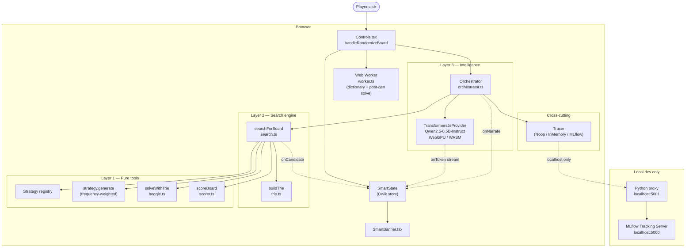
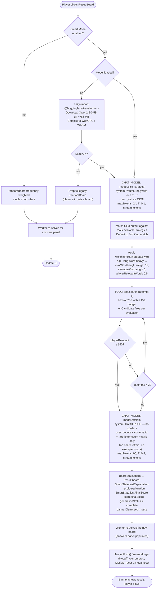
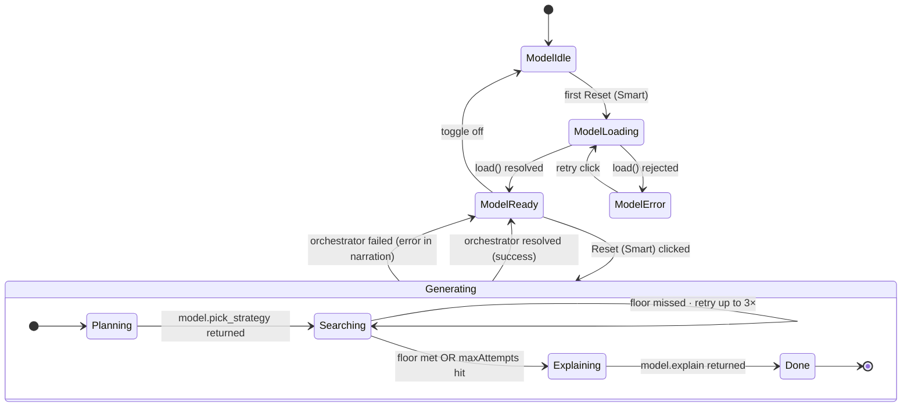
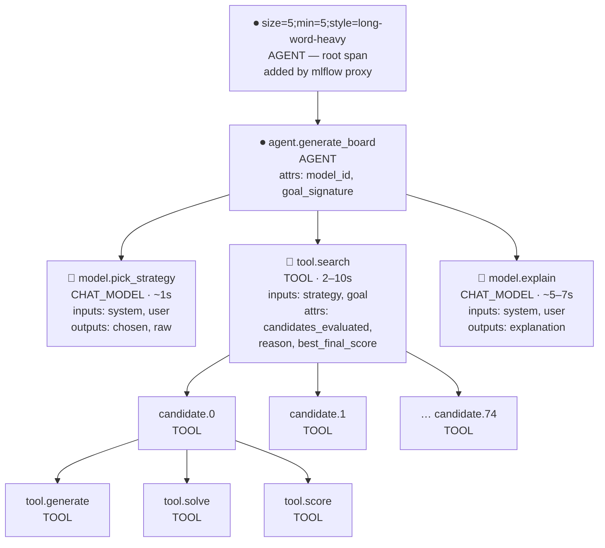
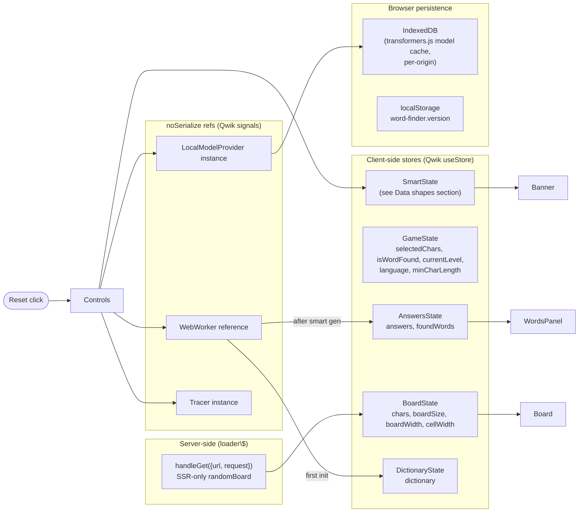

# Intelligent board generation — how it actually works

Companion to [`PLAN.md`](./PLAN.md) and [`AGENTIC_VISION.md`](./AGENTIC_VISION.md). Those docs describe the architecture and the asymptote; this doc walks through **what happens when a player clicks Reset Board** with diagrams pinned to the actual code paths.

You can navigate here by topic:

1. [Layered architecture](#layered-architecture) — three layers with hard boundaries
2. [End-to-end sequence](#end-to-end-sequence) — what happens on Reset, step by step
3. [Control flow](#control-flow) — the decision tree, including retry and fallback
4. [Smart Mode lifecycle](#smart-mode-state-machine) — model load + generation states
5. [Data shapes](#data-shapes) — types passing between layers
6. [The trace tree](#the-trace-tree) — what lands in MLflow per generation
7. [State management](#state-management) — where state lives, who reads/writes
8. [Business logic vs application logic](#business-logic-vs-application-logic) — what's a *rule* vs what's a *plumbing concern*

---

## Layered architecture

The three-layer rule from `PLAN.md` is enforced at the import level. **Layer 1 has no model dependency. Layer 2 has no model dependency.** Only Layer 3 talks to the SLM.



**Why the boundary matters.** If the SLM is unavailable (model failed to load, WebGPU denied, network gone), Smart Mode falls through to the Layer 1 / Layer 2 path with no orchestrator and gives the player a board anyway. The player never sees a blank screen because of an LLM hiccup.

---

## End-to-end sequence

This is what actually happens when the player clicks **Reset Board** with Smart Mode enabled (the default). On the first click of a session the model has to load; subsequent clicks skip straight to generation.

```mermaid
sequenceDiagram
  autonumber
  actor Player
  participant Controls as Controls.tsx
  participant Smart as SmartState (store)
  participant Provider as TransformersJsProvider
  participant Orch as Orchestrator
  participant Reg as Strategy registry
  participant Search as searchForBoard
  participant Strategy as Strategy.generate
  participant Solver as solveWithTrie
  participant Scorer as scoreBoard
  participant Tracer as Tracer
  participant Worker as Web Worker

  Player->>Controls: Reset Board
  Controls->>Smart: status=loading-model? generating? narration=[]
  Controls->>Provider: ensureSmartLoaded()
  alt model not yet loaded
    Provider->>Provider: dynamic-import @huggingface/transformers
    Provider->>Provider: pipeline('text-generation', Qwen2.5-0.5B, {dtype:'q4', device})
    Provider-->>Smart: progress callback (loaded/total)
  end
  Provider-->>Controls: ready

  Controls->>Orch: new Orchestrator({model, tracer, tools, budget, callbacks})
  Controls->>Orch: generateBoard(goal, dictionary)

  Orch->>Tracer: startTrace
  Orch->>Tracer: open root span: agent.generate_board (AGENT)

  rect rgba(160,200,255,0.18)
    Note over Orch,Provider: Step 1 — pick strategy
    Orch->>Smart: narrate "🤔 Asking model which strategy to use…"
    Orch->>Tracer: span model.pick_strategy (CHAT_MODEL)
    Orch->>Provider: generate({system: "router…", user: goal JSON, maxTokens:24, T:0.1, onToken})
    Provider-->>Smart: per-token chunks → liveTokens
    Provider-->>Orch: {text, elapsedMs}
    Orch->>Reg: validate text against availableStrategies
    Note over Orch: Falls back to first strategy if SLM<br/>output doesn't name a known one
    Orch->>Smart: narrate "💡 Strategy chosen: frequency-weighted"
  end

  rect rgba(160,255,180,0.18)
    Note over Orch,Search: Step 2 — search (with retry-to-floor)
    loop attempt = 1..maxAttempts (default 3)
      Orch->>Smart: narrate "🔍 Searching: best-of-200, target ≥150…"
      Orch->>Tracer: span tool.search (TOOL)
      Orch->>Search: searchForBoard({size, dict, strategy, weights, budget=200/15s, onCandidate})
      activate Search
      Search->>Trie: build once per dictionary
      loop up to 200 candidates within 15s
        Search->>Strategy: generate({size, language})
        Strategy-->>Search: 25-char board
        Search->>Solver: solveWithTrie(trie, board)
        Solver-->>Search: words[]
        Search->>Scorer: scoreBoard(board, words, {minLen, recentBoards, weights})
        Scorer-->>Search: BoardScore
        Search-->>Smart: onCandidate({index, total, bestScore, playerRelevant})
      end
      Search-->>Orch: SearchResult
      deactivate Search
      alt result.playerRelevantWords ≥ 150
        Orch->>Smart: narrate "✓ Floor met"
        Note over Orch: break loop
      else attempt < maxAttempts
        Orch->>Smart: narrate "↩️ Below floor, retrying…"
      end
    end
    Orch->>Smart: narrate "📊 Search done"
  end

  rect rgba(255,200,160,0.18)
    Note over Orch,Provider: Step 3 — explain (no-spoiler prompt)
    Orch->>Smart: narrate "💬 Asking model to explain…"
    Orch->>Tracer: span model.explain (CHAT_MODEL)
    Orch->>Provider: generate({system: "NEVER name words…", user: counts+ratios only, maxTokens:96, T:0.4})
    Provider-->>Smart: per-token chunks → liveTokens
    Provider-->>Orch: {text}
    Orch->>Smart: narrate "✅ Done"
  end

  Orch->>Tracer: close root span; finish trace with outcome
  Orch-->>Controls: OrchestratorResult

  Controls->>Smart: lastExplanation, lastStrategy, lastFinalScore, lastModelCalls, lastElapsedMs
  Controls->>Smart: generationStatus = complete; bannerDismissed = false
  Controls->>Worker: postMessage({language, board, minCharLength}) — re-solve for answers panel
  Controls->>Tracer: tracer.flush() (fire-and-forget)
  Tracer-->>Proxy: POST /traces (dev only — NoopTracer on prod)
```

The colored bands match the three orchestrator steps you see in MLflow's span tree: **pick → search → explain**, all under one AGENT root.

---

## Control flow

The decision tree, including the floor-retry loop and the legacy fallback. This is the playbook the orchestrator follows.



**Three things to notice:**

1. **The floor (≥150 player-relevant words) is a hard gate**, not a hint. Up to 3 search attempts, each with a fat budget (200 candidates / 15s). With per-attempt mean ~190 and σ ~33, three independent attempts miss the floor about 1% of the time; if they do miss, the orchestrator returns the best-scoring of the three and the narration logs "↩️ Below floor".
2. **The model is allowed to be wrong about strategy choice.** If Qwen replies with garbage, the validator falls back to the first registered strategy. The system stays correct.
3. **The explain prompt is fed *qualities*, not data.** The model sees counts and ratios but never the board letters or solver output, so it can't quote a real word.

---

## Smart Mode state machine

Two interlocking lifecycles: model load (once per session) and generation (per click).



The model load is **lazy**: nothing downloads until the player clicks Reset for the first time. Once `ModelReady`, every subsequent generation is just the inner state machine.

---

## Data shapes

The actual TypeScript types passed between layers. These are stable contracts — the offline optimizer (Phase 6) will tune *behavior*, not these shapes.

```mermaid
classDiagram
  direction LR

  class BoardGenerationGoal {
    +size: number
    +minWordLength: number
    +minPlayerRelevantWords?: number
    +maxAttempts?: number
    +style?: balanced|long-word-heavy|classic|rare-letter|chaotic
    +difficulty?: easy|medium|hard
    +novelty?: low|medium|high
    +requiredLetters?: string[]
    +preferredLetters?: string[]
    +avoidedLetters?: string[]
    +description?: string
  }

  class OrchestratorConfig {
    +model: LocalModelProvider
    +tracer: Tracer
    +tools: ToolRegistry
    +budget?: OrchestratorBudget
    +callbacks?: OrchestratorCallbacks
  }

  class OrchestratorCallbacks {
    +onNarrate?: (line) =&gt; void
    +onTokenStream?: (chunk, accumulator) =&gt; void
    +onSearchProgress?: (info) =&gt; void
  }

  class OrchestratorResult {
    +board: string
    +score: BoardScore
    +words: string[]
    +strategyChosen: string
    +explanation: string
    +modelCalls: number
    +elapsedMs: number
    +trace: GenerationTrace
  }

  class BoardScore {
    +totalWords: number
    +playerRelevantWords: number
    +wordsByLength: Record~length, count~
    +averageWordLength: number
    +maxWordLength: number
    +uniqueLetters: number
    +vowelRatio: number
    +vowelInventoryHash: string
    +prefixDiversity: number
    +letterEntropy: number
    +similarityToRecent: number
    +finalScore: number
  }

  class SearchResult {
    +board: string
    +score: BoardScore
    +words: string[]
    +strategyUsed: string
    +candidatesEvaluated: number
    +elapsedMs: number
    +reason: target-met|max-candidates|max-ms
    +trace?: GenerationTrace
  }

  class GenerationTrace {
    +trace_id: string
    +generation_id: string
    +goal_signature: string
    +prompt_versions: Record
    +model_versions: Record
    +spans: Span[]
    +outcome: GenerationOutcome
    +created_at: string
  }

  class Span {
    +span_id: string
    +parent_span_id: string|null
    +name: string
    +type: AGENT|CHAIN|CHAT_MODEL|TOOL|RETRIEVER|EVALUATION
    +start_ms: number
    +end_ms: number
    +attributes: Record
    +inputs?: any
    +outputs?: any
    +error?: object
  }

  class SmartState {
    +enabled: boolean
    +modelStatus: idle|loading|ready|error
    +modelLoadProgress: number
    +generationStatus: idle|running|complete|error
    +narration: string[]
    +liveTokens: string
    +searchProgress?: object
    +lastExplanation?: string
    +lastStrategy?: string
    +lastFinalScore?: number
    +bannerDismissed: boolean
    +refs: { provider, tracer }
  }

  class LocalModelProvider {
    <<interface>>
    +id: string
    +displayName: string
    +isReady: boolean
    +capabilities: { json, streaming, toolCalling }
    +load(onProgress?) Promise
    +generate(GenerateRequest) Promise~GenerateResponse~
  }

  class GenerateRequest {
    +messages: ChatMessage[]
    +maxTokens?: number
    +temperature?: number
    +jsonOnly?: boolean
    +signal?: AbortSignal
    +onToken?: (chunk) =&gt; void
  }

  OrchestratorConfig --> LocalModelProvider
  OrchestratorConfig --> OrchestratorCallbacks
  OrchestratorResult --> BoardScore
  OrchestratorResult --> GenerationTrace
  GenerationTrace --> Span
  SearchResult --> BoardScore
  LocalModelProvider --> GenerateRequest
```

**The `BoardGenerationGoal` is the contract between the player UI and the engine.** When we add a preferences panel later (style picker, required letters, novelty slider), it just builds one of these. Nothing else changes.

---

## The trace tree

What ends up in MLflow per generation. This is what the user sees clicking through `word-finder-player` → any trace.



A typical generation produces **~200+ spans**: 1 root + 1 agent + 2 model calls + 1 search + (75 candidates × 4 child spans). MLflow auto-classifies the experiment as "GenAI apps & agents" once it sees the AGENT/CHAT_MODEL types.

Every span carries:

- `mlflow.span.type` — drives the icon and the auto-classifier
- `mlflow.span.inputs` / `mlflow.span.outputs` — JSON-stringified, truncated to 8 KB
- Custom `word_finder.*` attributes on the AGENT root: `generation_id`, `final_score`, `candidates_evaluated`, `selected_strategy`, `elapsed_ms`. These are what offline analysis (Phase 6) joins on.

---

## State management

Three stores, three jobs.



**Why three stores not one.** Each store's lifetime is different:

- `BoardState` resets on Reset.
- `AnswersState` is rebuilt by the worker after each generation.
- `SmartState` survives across generations — the SLM and tracer instances live there, behind `noSerialize`.

**Why noSerialize.** Qwik tries to serialize stores so the page is resumable. Heavy objects (Transformers.js generator, MLflow tracer with in-flight Promises) can't be JSON-stringified, so we wrap them in `noSerialize()` and Qwik skips them.

---

## Business logic vs application logic

The user-facing rules — *what makes a board good, what counts as a fair board, what we promise the player* — live in pure functions. Application concerns — *how Qwik wires it up, where the model is hosted, what UI shows what* — live in components and hooks. The boundary is sharp on purpose.

| Concern | Layer | File | Why it lives there |
| --- | --- | --- | --- |
| What's a "fair" 5+ letter word path | Layer 1 (pure) | `boggle.ts` `getNeighbors` | Boggle rule. Same forever. |
| What's a "good" board score | Layer 1 (pure) | `scorer.ts` `scoreBoard` | Player-experience definition. Tunable, but pure. |
| Vowel ratio sweet spot (~0.38) | Layer 1 (pure) | `scorer.ts` `DEFAULT_WEIGHTS` | English-text statistic; product knob. |
| Strategy weights per style | Layer 1 (pure) | `orchestrator.ts` `weightsForStyle` | Product / SLM-orchestration knob. |
| ≥150 player-relevant words floor | Layer 3 | `Controls.tsx` (default goal) | **Product promise.** "Smart Mode never gives you a thin board." |
| 3 attempts to meet floor | Layer 3 | `Controls.tsx` (default goal) | Implementation choice that flows from the product promise. |
| 200 candidates / 15s search budget | Layer 3 | `Controls.tsx` budget config | Performance knob; must be high enough that the floor is reachable. |
| "Never spoil words in explanation" | Layer 3 (prompt) | `orchestrator.ts` `EXPLAIN_SYSTEM` | **Product promise.** Hard rule baked into the system prompt + we don't pass words/letters to the model. |
| MLflow only on localhost | Application | `Controls.tsx` (NoopTracer branch) | Plumbing. Production has no public MLflow to talk to. |
| Smart Mode default-on | Application | `BoggleRoot.tsx` | Product default. |
| Lazy-load model on first Reset | Application | `Controls.tsx` `ensureSmartLoaded` | Performance / UX. |
| Web Worker for dictionary + post-gen solve | Application | `BoggleRoot.tsx` | Don't block the UI thread. |
| `data-testid` selectors | Application | All components | Testing harness. |
| Version footer + meta + window globals | Application | `version.ts`, `VersionFooter.tsx` | Operational. |

**Reading this table top to bottom** is reading the product, then reading the implementation. They're separable.

---

## What's *not* in this doc (yet)

These are the deliberately-deferred pieces from `PLAN.md` and `AGENTIC_VISION.md`:

- **Recipe memory** — IndexedDB-backed bandit over `(goal_signature, strategy, params)` tuples that biases future generation toward what worked. Phase 4.
- **More strategies** — `n-gram`, `seed-word`, `dice-shuffle`. Phase 1 polish; would expand the orchestrator's strategy choice from 1 to 4.
- **Goal-config UI** — preferences panel feeding `BoardGenerationGoal`. Today we hardcode `style: long-word-heavy`. Phase 3.
- **Web Worker integration for SLM** — orchestrator runs on the main thread today, blocking the UI for ~5–10s during generation. Moving SLM + orchestrator into a worker is the next UX win.
- **Offline prompt optimization** — DSPy-style auto-tuning against the captured `(trace, outcome)` dataset, ships optimized prompt versions. Phase 6.

Each of these slots into the existing architecture without breaking the layer boundaries — that's the whole point of the boundaries.
