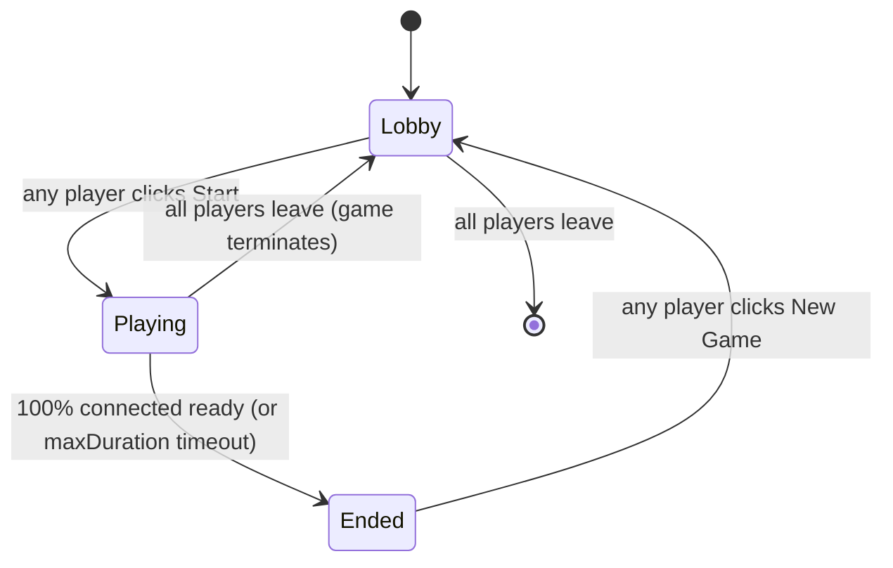

# Multiplayer — shared games, unique-word scoring

Plan for a new feature: real-time multiplayer Word Finder. Multiple players share a board, each searches independently, the player with the most **unique** words wins (words found by 2+ players cancel out for everyone).

This doc is the **starting point for a new conversation/branch**. It's complete enough that a fresh Claude session should be able to read it and start building without re-debating the architecture.

> Pre-context: the app is a Qwik SSR Boggle clone deployed to Cloudflare Pages (`word-finder-eak.pages.dev`). Existing infrastructure includes a `LocalModelProvider` pattern, a `Pipeline` runner with role registry, a `BatchDashboard` side panel, and a `PipelineLab` side panel — all using the `.glass` aesthetic from the Controls panel. See `docs/AI_ENGINEERING.md` for the platform overview.

## 1 — User-facing concept

**Joining a game:**
- Player opens the right-edge **🎮 Multiplayer** tab (third tab joining Stats + Lab)
- Types a game name (`alex's saturday game`) and a display name
- Clicks Join — if the game exists, they enter the lobby; if not, the game is created and they become the first player

**Lobby:**
- List of players who've joined (live, with connection dots)
- Any player can click **Start game** — proposes to start; game starts when ≥1 player has proposed (no need for unanimous start; the proposer can play solo until others arrive)
- Players who join after start enter the **playing** state directly with the same board

**Playing:**
- Same Boggle board everyone sees
- Player taps cells to find words; server validates and announces "Alice found WHISPER" to everyone
- Player list updates live with each player's word count: `Alice 12 · Bob 8 · You 14`
- Each player has an **"I'm ready to end"** toggle
- When 100% of connected players have toggled ready, game ends automatically

**Ended:**
- Results screen tallies **unique words only**: words only one player found
- Common words (2+ players) earn 0 points for everyone — that's the twist
- Sorted leaderboard, winner highlighted
- "New game" button → back to lobby

## 2 — Scoring (the twist)

```
For each word W in the union of all players' found words:
  let n = number of players who found W
  if n == 1: award 1 point to the lone finder
  if n >= 2: award 0 points to anyone (W is "shared")

Winner: max(points). Ties displayed, no tiebreaker.
```

UX implication: each player sees their own list split into **Unique (your points)** vs **Shared (zeroed)**. They can see which words got nullified by an opponent — a satisfying signal. Add a sparkle to unique words and a strikethrough on shared.

Optional v2: weight by word length (`max(1, length - 4)` so a 9-letter unique word is worth 5 points). Decide after first playtest. Start with flat 1-point-per-unique.

## 3 — Architecture

### Real-time backbone: Cloudflare Durable Objects

The repo is already on Cloudflare Pages with a Pages Function pattern (`functions/api/llm.ts` for the SLM bridge). Add a second Pages Function (`functions/api/games/[name].ts`) that upgrades the request to a WebSocket and proxies to a **Durable Object** scoped by game name.

Why Durable Objects:
- Each game = one DO instance. Strong consistency across all players in the room.
- DO serializes all incoming messages, so state transitions are atomic with no explicit locking.
- Built-in storage persists game state across node restarts.
- WebSocket Hibernation API keeps cost low for idle games.
- Already in the Cloudflare ecosystem we deploy to. No new vendor.

Why not third-party (Pusher, Ably, PartyKit):
- New vendor, new auth, new pricing. The DO path is one more `wrangler.toml` binding away.
- PartyKit *is* Durable Objects under the hood with a nicer DX — could be a v2 swap if developer ergonomics become a problem.

Why not polling:
- This game's UX requires sub-second feedback ("Alice found a word" should appear in <500ms). Polling at that frequency = bad UX + bad cost.

### Wrangler binding

```toml
# wrangler.toml — added to existing config
[[durable_objects.bindings]]
name = "GAME_ROOM"
class_name = "GameRoom"
script_name = "word-finder"  # Pages Functions ship under the project name

[[migrations]]
tag = "multiplayer-v1"
new_classes = ["GameRoom"]
```

### File layout

```
functions/api/games/[name].ts          # WS upgrade → DO routing
src/server/durable-objects/GameRoom.ts # the DO class
src/components/boggle/multiplayer/
  MultiplayerPanel.tsx                 # the side panel
  PlayerList.tsx                       # connected players + word counts
  EndGameResults.tsx                   # winner + unique/shared breakdown
  JoinForm.tsx                         # name + display name input
  client.ts                            # WS client wrapper (auto-reconnect)
  protocol.ts                          # message type schema (zod or pure TS)
  storage.ts                           # localStorage player id + display name
  scoring.ts                           # pure scoring fn (unit-testable)
  path-validation.ts                   # server-side Boggle path check
src/components/boggle/context.tsx       # add MultiplayerCtx
docs/MULTIPLAYER.md                    # this file lives at PLAN_MULTIPLAYER.md
                                       # → ship as MULTIPLAYER.md once built
tests/unit/multiplayer/
  scoring.test.ts                      # the unique-vs-shared algorithm
  path-validation.test.ts              # boggle path on a 5x5
  protocol.test.ts                     # message schema round-trips
tests/e2e/multiplayer.spec.ts          # 2-tab Playwright test
```

## 4 — State model (per game)

```ts
interface GameState {
  name: string;                  // canonical (lowercase, slugified)
  displayName: string;           // raw input ("alex's saturday game")
  state: 'lobby' | 'playing' | 'ended';
  hostPlayerId: string;          // first to connect

  // Board fields — populated on transition to 'playing'.
  // Reuse the existing pipeline runner: when game starts, run the
  // current champion pipeline once; that result becomes the shared
  // board everyone plays on.
  board: string;                 // 25 chars
  boardSize: number;             // 5
  language: 'English';
  minCharLength: number;
  pipelineId: string;            // which pipeline produced the board
  pipelineFinalScore: number;
  startedAt: number | null;
  endedAt: number | null;

  // Optional time cap.
  maxDurationMs?: number;        // null = no cap, ends only on consensus

  players: Record<string, PlayerState>;
}

interface PlayerState {
  id: string;                    // UUID, persistent in localStorage
  displayName: string;
  joinedAt: number;
  // Authoritative — only words the server has validated.
  // Stored as canonical lowercase. Set, not array (no duplicates).
  foundWords: string[];
  readyToEnd: boolean;
  lastSeenAt: number;            // for presence
  connected: boolean;            // false after heartbeat timeout
}
```

## 5 — Protocol

WebSocket frames are JSON with a `type` discriminator. Server-side schema validation (zod) rejects malformed frames.

### Client → Server

| `type` | Payload | When |
|---|---|---|
| `join` | `{ playerId, displayName, gameName }` | First message after WS open |
| `start` | `{}` | Any player in lobby |
| `found` | `{ word: string }` | During playing |
| `ready` | `{ ready: boolean }` | During playing; toggle |
| `leave` | `{}` | Optional; otherwise WS close = leave |
| `heartbeat` | `{}` | Every 25 s |

### Server → Client (broadcast to room)

| `type` | Payload | When |
|---|---|---|
| `state` | full `GameState` | On join, and after any state change |
| `player_joined` | `{ player: PlayerState }` | When new player connects |
| `player_left` | `{ playerId }` | When player disconnects |
| `player_found` | `{ playerId, word, totalCount }` | Validated word |
| `player_ready` | `{ playerId, ready }` | Toggle |
| `game_started` | `{ board, startedAt, pipelineId }` | Lobby → playing |
| `game_ended` | `{ results: ResultsPayload, endedAt }` | Playing → ended |
| `error` | `{ code, message }` | Validation rejection |

`ResultsPayload`:
```ts
interface ResultsPayload {
  perPlayer: Array<{
    playerId: string;
    displayName: string;
    foundWords: string[];        // everything they found
    uniqueWords: string[];       // subset that's only theirs
    sharedWords: string[];       // subset others also found
    points: number;              // === uniqueWords.length (v1)
    rank: number;                // 1 = winner, ties share rank
  }>;
  winnerIds: string[];           // ≥1 (ties allowed)
}
```

### Validation rules (server-side)

For `found`:
1. Game must be in `playing` state, else `error: not_playing`
2. Word must be ≥ `minCharLength`, else `error: too_short`
3. Word must be in dictionary, else `error: not_a_word`
4. Word must trace a valid Boggle path on the board (adjacency, no cell reuse), else `error: invalid_path`
5. Player must not have already submitted this word, else `error: already_found`
6. On success: append to player's `foundWords`, broadcast `player_found`

For `start`:
1. Must be in `lobby`, else `error: not_in_lobby`
2. Anyone can trigger; transition to `playing` immediately, broadcast `game_started`
3. Run the current champion pipeline server-side to produce the board
   - Use the existing `runPipeline` infrastructure; the DO bundles a no-mock `MockProvider` (deterministic) for v1, real model for v2
   - v1 fallback: run `frequencyWeightedStrategy.generate({ size: 5, language: English })` directly on the server — fast, deterministic enough, no model needed in the DO

For `ready`:
1. Must be in `playing`, else ignore
2. Set `players[playerId].readyToEnd = ready`
3. Broadcast `player_ready`
4. If `every connected player has readyToEnd === true && there's at least 1 connected player` → end game

## 6 — End-game state machine



### Handling disconnects mid-game

When a player WS closes (or heartbeat times out):
1. Mark `players[playerId].connected = false` (don't delete — their found words still count toward the shared/unique tally)
2. If any other players remain, broadcast `player_left`
3. Re-check end-game consensus: a disconnected player's `readyToEnd` doesn't block — only **connected** players gate the end vote
4. If all players have left, the DO sets `state = ended` (timeout-triggered) and persists final state for replay

### Reconnection

Player rejoins with same `playerId` (from localStorage):
1. Server finds their `PlayerState`, sets `connected = true`, updates `lastSeenAt`
2. Sends them the full `state` snapshot
3. Broadcasts `player_joined` to others (idempotent display update)
4. Their `foundWords` are intact

## 7 — UI

New side panel: **🎮 Multiplayer** at right-edge tab position above 📊 Stats. Glass shell matching the others.

### Panel states

```
DISCONNECTED:
  ┌────────────────────────────┐
  │ 🎮 Multiplayer       ×     │
  ├────────────────────────────┤
  │ Game name                  │
  │ [_________________]        │
  │ Your name                  │
  │ [_________________]        │
  │           [ Join game ]    │
  │                            │
  │ Last played: alex-sat (3)  │ ← localStorage memory
  └────────────────────────────┘

LOBBY:
  ┌────────────────────────────┐
  │ 🎮 alex-sat-game     ×     │
  ├────────────────────────────┤
  │ 3 players in lobby         │
  │  ● You (Alex)              │
  │  ● Bob                     │
  │  ● Carol                   │
  │                            │
  │       [ Start game ]       │
  └────────────────────────────┘

PLAYING:
  ┌────────────────────────────┐
  │ 🎮 alex-sat-game     ×     │
  ├────────────────────────────┤
  │ Started 2:14 ago           │
  │  ● You (Alex)    14 words  │
  │  ● Bob           12 words  │ ← live updates
  │  ● Carol          9 words  │
  │  ◯ Dave (left)    3 words  │
  │                            │
  │  [ ✓ I'm ready to end ]    │ ← toggle
  │  Waiting for Bob, Carol…   │ ← who hasn't ready'd
  │                            │
  │  Recent: Bob found WHISPER │ ← last 3-5 events
  └────────────────────────────┘

ENDED:
  ┌────────────────────────────┐
  │ 🎮 Game ended         ×    │
  ├────────────────────────────┤
  │  🏆 Bob wins (8 unique)    │
  │  ▓▓▓▓▓▓▓▓ Bob       8      │
  │  ▓▓▓▓▓▓   You       6      │
  │  ▓▓▓▓     Carol     4      │
  │  ▓        Dave      1      │
  │                            │
  │ Your unique (✨ 6 points): │
  │   WHISPER, GRAPHITE, …     │
  │ Your shared (—):           │
  │   ~~CASTLE~~ also Bob      │
  │   ~~PEOPLE~~ also Bob,Carol│
  │                            │
  │       [ New game ]         │
  └────────────────────────────┘
```

### Test hooks (data-testid)

| Element | data-testid |
|---|---|
| Right-edge tab | `multiplayer-toggle` |
| Panel container | `multiplayer-panel` (with `data-state="disconnected\|lobby\|playing\|ended"`) |
| Game-name input | `mp-game-name-input` |
| Display-name input | `mp-display-name-input` |
| Join button | `mp-join` |
| Start button | `mp-start` |
| Ready toggle | `mp-ready-toggle` (with `data-ready="true\|false"`) |
| Player row | `mp-player-row` (with `data-player-id`, `data-connected`, `data-ready`, `data-word-count`) |
| Recent event line | `mp-event-line` |
| Results row | `mp-results-row` (with `data-rank`, `data-points`) |
| New-game button | `mp-new-game` |

### Integration with existing player flow

- The Boggle board, when a multiplayer game is in `playing` state, displays the **shared** board (from `multiplayer.gameState.board`) instead of the locally-generated one. This swaps `boardState.chars` once when the game starts.
- The existing word-finding flow stays — when a word is detected by `handleFoundWord`, it gets emitted via WS instead of just landing in `answersState.foundWords`. The server's `player_found` echo back is what populates `foundWords`.
- The `Smart Mode` Reset Board flow becomes inert during a multiplayer game (or hidden — TBD). Player can leave the game and return to single-player mode any time.
- The dashboard (📊 Stats) and Pipeline Lab (🧪) are independent of multiplayer state — they describe pipelines, not games.

## 8 — Server-side word + path validation

The DO needs:
1. The English dictionary (engmix.txt — same source the client uses)
2. Boggle path validation (adjacency rules, no cell reuse)

### Dictionary

Bundle the dictionary as a static asset. Load on first DO instantiation. Build a `Set<string>` for O(1) lookup. Memory: ~85k words × ~7 chars = ~600 KB — well within DO RAM.

Pure-module split is already done: `letter-frequency.ts`, `legacy-pools.ts`, `boggle.ts` (solveWithTrie), `trie.ts`. Importable from a Worker with no Qwik dependency.

### Path validation (new)

```ts
// src/components/boggle/multiplayer/path-validation.ts
export const isValidBoggleWord = (
  word: string,
  board: string,
  size: number
): boolean => {
  // DFS: try each cell as start; check if the word can be traced
  // through 8-directional neighbors with no cell reuse.
  const grid = board.toLowerCase().split('');
  const target = word.toLowerCase();
  if (target.length === 0) return false;

  const idx = (row: number, col: number): number => row * size + col;
  const neighbors = (i: number): number[] => {
    const r = Math.floor(i / size);
    const c = i % size;
    const out: number[] = [];
    for (let dr = -1; dr <= 1; dr++) {
      for (let dc = -1; dc <= 1; dc++) {
        if (dr === 0 && dc === 0) continue;
        const nr = r + dr, nc = c + dc;
        if (nr >= 0 && nr < size && nc >= 0 && nc < size) {
          out.push(idx(nr, nc));
        }
      }
    }
    return out;
  };
  const dfs = (cellIdx: number, wordIdx: number, visited: Set<number>): boolean => {
    if (grid[cellIdx] !== target[wordIdx]) return false;
    if (wordIdx === target.length - 1) return true;
    visited.add(cellIdx);
    for (const n of neighbors(cellIdx)) {
      if (!visited.has(n) && dfs(n, wordIdx + 1, visited)) return true;
    }
    visited.delete(cellIdx);
    return false;
  };
  for (let i = 0; i < grid.length; i++) {
    if (dfs(i, 0, new Set())) return true;
  }
  return false;
};
```

This is symmetric to what the client-side `updatePath` enforces visually, but server-side validates regardless of what the client claims.

## 9 — Identity (no auth, persistent)

```ts
// src/components/boggle/multiplayer/storage.ts
const PLAYER_ID_KEY = 'word-finder.player-id';
const DISPLAY_NAME_KEY = 'word-finder.display-name';

export const getOrCreatePlayerId = (): string => {
  let id = localStorage.getItem(PLAYER_ID_KEY);
  if (!id) {
    id = crypto.randomUUID();
    localStorage.setItem(PLAYER_ID_KEY, id);
  }
  return id;
};
```

No auth, no accounts. Player id is just a stable UUID. If they clear localStorage, they get a new identity (and lose the ability to rejoin a mid-game). Acceptable for a casual word game.

## 10 — Phased rollout

### Phase 1 — Core multiplayer (this kickoff session's target)

- [ ] `src/server/durable-objects/GameRoom.ts` — DO class with state, message handlers, dictionary loading
- [ ] `functions/api/games/[name].ts` — WS upgrade → DO
- [ ] `wrangler.toml` — DO binding + migration
- [ ] `src/components/boggle/multiplayer/protocol.ts` — message schema + zod validators
- [ ] `client.ts` — WS client with auto-reconnect, exponential backoff, heartbeat
- [ ] `MultiplayerPanel.tsx` (with all 4 states) + `JoinForm.tsx` + `PlayerList.tsx` + `EndGameResults.tsx`
- [ ] Wire into `BoggleRoot.tsx`, add right-edge tab in `MultiplayerPanel.tsx`
- [ ] `multiplayerCtx` in `context.tsx` (gameState, playerId, displayName, ws ref)
- [ ] Board swap: when `multiplayer.state === 'playing'`, board becomes `multiplayer.gameState.board`
- [ ] Word emission: `handleFoundWord` checks if multiplayer is active → emit WS instead of (or in addition to) the local found-words flow
- [ ] Unit tests: scoring, path validation, protocol round-trip
- [ ] E2E test: 2 Playwright tabs join same game, find different words, ready up, see correct winner

### Phase 2 — Polish

- [ ] URL deep-linking: `?game=alex-sat&name=Alex` auto-joins
- [ ] Recent games list (localStorage of last 5 game names)
- [ ] Spectator mode (join without finding words)
- [ ] Display name editing
- [ ] Heartbeat tuning + ghost-player UX (gray dot, "(disconnected 30s ago)")
- [ ] Per-game timer option

### Phase 3 — Advanced

- [ ] Length-weighted scoring variant (toggleable per game)
- [ ] Chat between players (rate-limited)
- [ ] Game history / replay
- [ ] Per-game leaderboard across sessions (DO-stored)
- [ ] Custom rules: required letters, themed prompts (uses the SLM-parsed-prompt pipeline!)

## 11 — Risks

| Risk | Why it matters | Mitigation |
|---|---|---|
| Cloudflare Pages + DO WS support | Pages historically didn't support WS + DO; status changed in 2024–2025 — re-verify with the latest CF docs at kickoff | Verify in Phase 1 spike. Fallback: deploy multiplayer as a separate Worker (`api.word-finder-eak.dev`) and CORS to it. |
| WS cost | DO charges per-duration + per-message. 10 players × 5min game × 1 msg/sec = 3000 msgs. Cheap. | Set per-player rate limit (10 msgs/sec); enforce in DO. |
| Server-side dictionary memory | 85k-word Set in every DO — fine for runtime, but eats DO startup time | Lazy-load on first `start`; cache in DO storage as a serialized form |
| Ghost players block end-game | If we counted disconnected players as needing-to-be-ready, the game would never end after a tab close | Disconnected (heartbeat-timed-out) players don't gate end-game consensus. Only `connected: true` players need to ready. |
| Trolling: player joins to grief | Empty-name spam, leaving repeatedly | Phase 1 leaves this open. Phase 2: rate-limit `join` per IP, require non-empty display name |
| Common-word collusion | Two players agree to flood common words to nullify a third's lead | The unique-only rule already mitigates this — colluders also cancel each other's words. Acceptable game-theory edge case. |
| Cheat: player submits invalid word | Hacked client | Server validates dictionary + path. Reject with `error: invalid_path`. |
| Network reordering | `found` arrives before `start` confirmed | DO serializes; transitions are atomic. Server returns `error: not_playing` cleanly. |
| Two players claim same name | Confusing display | Add `(2)` disambiguator in display, or reject with `error: name_taken` (configurable per game) |

## 12 — Open questions for kickoff

1. **Should the host have privileges**, or is everyone equal? (Default plan: everyone equal — anyone can start, anyone can leave, end-game by consensus.)
2. **Should new joiners during 'playing' state be allowed?** Spectator-yes, player-yes? Or freeze the player list at start? (Default: allow joining mid-game; latecomers play with the disadvantage of less time.)
3. **Should pipelines other than the champion be selectable** for the multiplayer board? (Default: champion only, to keep the lobby UI simple. Lab users can promote a different pipeline → champion → all multiplayer games use it.)
4. **Time-limit option** at game start? (Default: no — pure consensus end. Add later if play-tests show games dragging.)
5. **Dictionary** — bundle into the DO at build time, or fetch from `boggle.pages.dev/engmix.txt` on first init? (Default: fetch on init, cache in DO storage.)

## 13 — First-session prompt template

> *"I want to start building the multiplayer feature documented in `docs/PLAN_MULTIPLAYER.md`. Read that file first, then start with the Phase 1 spike: scaffold the Durable Object + Pages Function + WS protocol, with a smoke test that two `wscat` clients can connect to the same game and exchange messages. We can add the UI on top once the server side is proven. Branch off `main` as `feat/multiplayer`. Verify Cloudflare Pages + DO WebSocket compatibility before committing to the architecture — if Pages still doesn't support WS for DOs, fall back to deploying the multiplayer server as a standalone Worker."*

## 14 — Definition of done for Phase 1

- Two browser tabs can join the same game by name, see each other in the player list with live word counts, and end the game by consensus
- Server-side validation rejects invalid words (not in dictionary, invalid path, already found)
- Disconnected players don't block end-game consensus; reconnects pick up state seamlessly
- Scoring correctly identifies unique vs shared words; winner is the max-unique-count player; ties share rank
- 5+ unit tests pass (scoring algorithm × edge cases, path validation × edge cases)
- 1+ Playwright multi-tab e2e test passes
- Glass UI matches the existing aesthetic; right-edge tab + slide-in panel
- Existing single-player flow (Smart Mode Reset, Pipeline Lab, Batch Dashboard) is unaffected when not in a game
- Build green, lint clean, deployed to prod, verified on `word-finder-eak.pages.dev`

## See also

- `docs/AI_ENGINEERING.md` — pipeline platform; multiplayer board generation reuses the champion pipeline
- `docs/SERVER_SLM.md` — Cloudflare Pages Function pattern for backend code; multiplayer follows the same shape
- `docs/FEATURES.md` — player-facing feature reference; gets updated when this ships
- `wrangler.toml` — `[ai]` binding already exists; multiplayer adds `[[durable_objects.bindings]]`
